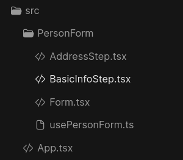

# Multi-step form using useForm library

Hi folks, in this tutorial I want to show you, how easily you can build a multi-step form using `use-form` library, and `react-use-wizard`. This kind of forms is super useful when you want to save complex, or forms with many fields, so, let's do that.

## Introduction

One of the challenges to build multi-step forms is how to manage the entire form across many step components that should keep parts of the same form, with the same validation schema, same submit button, and same state. Using another libraries forms, you should do that by some implementation of React Context API, and `useContext` hook.

But when using `use-form`, you don't need anything of this, you just have to create just one form, and use it across of the steps, let start, and you will figure out how this is possible.

## Preparing the application

The first thing we need to do is to prepare an application to develop your example of multi-step form, we can do that, by using React + Vite, using [Codesandbox](https://codesandbox.io) it can be easily, there are template for React + Vite on Codesandbox.

After that, we should add some dependencies to develop your example, obviously we are going to install `@use-form/use-form`, `react-use-wizard`, and to save some time, and have a beautiful result, we can add `chakra-ui`, fell free to use another library or CSS library.

> You can just add those packages in `package.json` on Codesandbox, or if you are developing in localhost, run the fallowing command:

```bash
    yarn add @use-form/use-form react-use-wizard
```

```bash
yarn add @chakra-ui/react @emotion/react @emotion/styled framer-motion
```

## Creating the application

First step is to organize the `App.tsx` file, we are going to add a title, and some stuff to make the layout look better.

```tsx
import { ChakraProvider, Text, Box, Input } from "@chakra-ui/react";
import { PersonForm } from "./PersonForm/Form";

function App() {
  return (
    <ChakraProvider>
      <Box display="flex" justifyContent="center">
        <Text fontSize="2xl">Multi-step form example</Text>
      </Box>
      <PersonForm />
    </ChakraProvider>
  );
}

export default App;
```

## Creating the form

Templates, and components aren't the first thing we need to think were, first, we need to think what is really important, and what are we building. We are building a multi-step form, so, before to develop the templates, ans components, we need to know how this form will works, if there are any rules, or validations, and the fields that we will have in it,and how many steps we need.

In this example, let develop a form that should submit information about a person, this form should have two steps:

- First step will deal with basic information about this person, like; first name, last name, and age.
- Second step will deal with complementary information, it's, address; street, city, zip code.

## Codding the usePersonForm

To do that, we are going to create a file named `usePersonForm.ts` into `PersonForm`:

```tsx
import { createForm } from "@use-form/use-form";

export const usePersonForm = createForm({
  initialValues: {
    firstName: "",
    lastName: "",
    age: null,
    address: {
      street: "",
      city: "",
      zipCode: null,
    },
  },
});
```

## Codding the Form component

The `Form` component should keep all the steps, and the event handlers for `submit`, and `reset` events, this components:

```tsx
import { Person, usePersonForm } from "./usePersonForm";
import { Wizard } from "react-use-wizard";
import { BasicInfoStep } from "./BasicInfoStep";
import { AddressStep } from "./AddressStep";

export function PersonForm() {
  const form = usePersonForm();

  function handleSubmit(e: Person) {
    console.log(e);
  }

  function handleReset(_: React.FormEvent) {
    form.reset();
  }

  return (
    <form onReset={handleReset} onSubmit={form.handleSubmit(handleSubmit)}>
      <Wizard>
        <BasicInfoStep />
        <AddressStep />
      </Wizard>
    </form>
  );
}
```

## Codding steps

Steps components should keep the form fields, and manage it.

### Codding BasicInfoStep

- The first thing we need to do is to import, and use `useWizard` hook, this hook manage the Wizard step position, it should be more convenient if we could manage it from `Form`, it could save some lines of code.
- The second step is to import, and use `usePersonForm` hook, we are going to use this hook here to register every field with the register function.
- The last step is to add some buttons to navigate to next step, and to reset the form value.

```tsx
import { Input, Text } from "@chakra-ui/react";
import { usePersonForm } from "./usePersonForm";
import { Button, Stack } from "@chakra-ui/react";
import { useWizard } from "react-use-wizard";

export function BasicInfoStep() {
  const { previousStep, nextStep } = useWizard();
  const { register } = usePersonForm();

  return (
    <Stack p={10}>
      <Text fontWeight={"bold"}>Basic Info</Text>
      <Input mt={5} placeholder="First name" ref={register("firstName")} />
      <Input mt={5} placeholder="Last name" ref={register("lastName")} />
      <Input mt={5} placeholder="Age" type="number" ref={register("age")} />

      <Stack direction="row" spacing={4} justify="center" mt={5}>
        <Button type="reset">Reset</Button>
        <Button onClick={nextStep}>Next</Button>
      </Stack>
    </Stack>
  );
}
```

### Codding AddressStep

- The first thing we need to do is to import, and use `useWizard` hook, this hook manage the Wizard step position, it should be more convenient if we could manage it from `Form`, it could save some lines of code.
- The second step is to import, and use `usePersonForm` hook, we are going to use this hook here to register every field with the register function.
- The last step is to add some buttons to submit the form, to reset the form value, and navigate to previous step.

```tsx
import { Input } from "@chakra-ui/react";
import { Button, Stack, Text } from "@chakra-ui/react";
import { usePersonForm } from "./usePersonForm";
import { useWizard } from "react-use-wizard";

export function AddressStep() {
  const { previousStep } = useWizard();
  const { register } = usePersonForm();

  return (
    <Stack p={10}>
      <Text fontWeight={"bold"}>Address</Text>
      <Input mt={5} placeholder="Street" ref={register("address.street")} />
      <Input mt={5} placeholder="City" ref={register("address.city")} />
      <Input mt={5} placeholder="Zip Code" ref={register("address.zipCode")} />

      <Stack direction="row" spacing={4} justify="center" mt={5}>
        <Button onClick={previousStep}>Previous</Button>
        <Button type="reset">reset</Button>
        <Button type="submit">Submit</Button>
      </Stack>
    </Stack>
  );
}
```

This is the final file structure of the example:



You can see the result in the [Codesandbox](https://codesandbox.io/p/sandbox/musing-margulis-z3m0nf)

## Conclusion

Build a multi-step form can be easy if you use the right tools to build it. In this tutorial I showed you how `use-form` can do that easily. Using `use-form` you can go on, and build more complex forms multi-step, or not.
